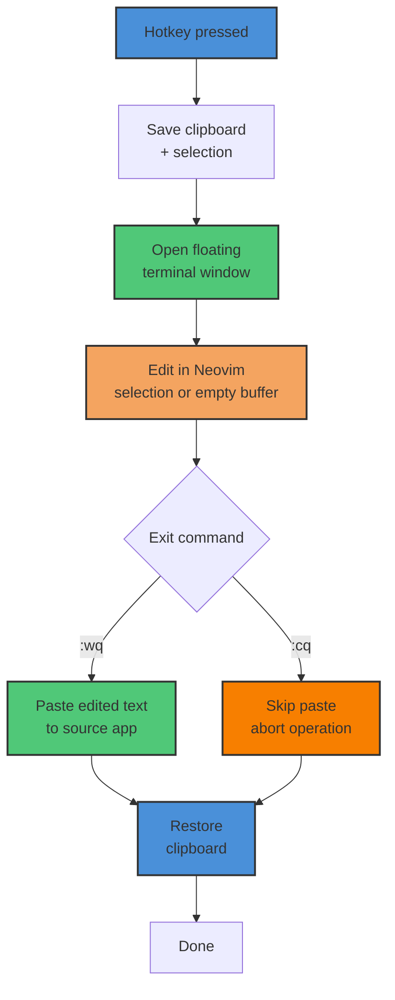

<p align="center">
  
</p>

# always-nvim
<!--toc:start-->
- [always-nvim](#always-nvim)
  - [What It Does](#what-it-does)
  - [Features](#features)
  - [Requirements](#requirements)
    - [Common](#common)
    - [X11](#x11)
    - [Wayland (Hyprland)](#wayland-hyprland)
  - [Installation](#installation)
    - [Quick Install](#quick-install)
    - [What the Install Script Does](#what-the-install-script-does)
    - [Manual Installation](#manual-installation)
  - [Configuration](#configuration)
    - [Example Config](#example-config)
  - [Window Manager Setup](#window-manager-setup)
    - [i3](#i3)
    - [Hyprland](#hyprland)
    - [Other Window Managers](#other-window-managers)
  - [Usage](#usage)
    - [Mode A: Insert New Text](#mode-a-insert-new-text)
    - [Mode B: Edit Selected Text](#mode-b-edit-selected-text)
    - [Aborting](#aborting)
    - [Command-Line Flags](#command-line-flags)
  - [Performance Tips](#performance-tips)
    - [1. Set the APPNAME in your config](#1-set-the-appname-in-your-config)
    - [2. Create a minimal init.lua](#2-create-a-minimal-initlua)
  - [License](#license)
<!--toc:end-->

Edit anywhere with Neovim -- a floating terminal that captures your clipboard, opens Neovim, and pastes the result back.

## What It Does

always-nvim lets you use Neovim as a universal text input tool. Press a hotkey from any application, and a floating terminal appears with your selected text (or an empty buffer). Edit in Neovim, save and quit, and the edited content is pasted back into the original application. Your clipboard is restored automatically.



## Features

- **Dual mode operation** -- Insert mode (empty buffer for new text) and Edit mode (pre-filled with your current selection)
- **X11 and Wayland/Hyprland support** -- Automatic backend detection with manual override
- **Automatic clipboard save/restore** -- Your clipboard contents are preserved across edits
- **Configurable terminal** -- Use Alacritty (default), kitty, foot, or any terminal that supports `-e`
- **Configurable filetype** -- Set the temp file extension for Neovim syntax highlighting (default: `md`)
- **Custom Neovim arguments** -- Pass extra flags to Neovim via config
- **Adjustable timing delays** -- Fine-tune paste and focus delays for your system
- **NVIM_APPNAME support** -- Use an isolated Neovim config for faster startup
- **Lock file protection** -- Prevents multiple instances from running simultaneously
- **Stale temp file cleanup** -- Automatically removes temp files older than 60 minutes on startup

## Requirements

### Common

- **Bash** 4.0+
- **Neovim** 0.9+
- A terminal emulator that supports `-e` for command execution (Alacritty is the default)

### X11

- `xclip` -- Clipboard access
- `xdotool` -- Window focus and keystroke simulation

### Wayland (Hyprland)

- `wl-clipboard` (`wl-paste`, `wl-copy`) -- Clipboard access
- `wtype` -- Keystroke simulation
- `hyprctl` -- Window management (ships with Hyprland)
- `jq` -- JSON parsing for window data

## Installation

### Quick Install

```bash
git clone https://github.com/user/always-nvim.git
cd always-nvim
./install.sh
```

### What the Install Script Does

1. Copies `always-nvim`, `backends/`, and `lib/` to `~/.local/bin/`
2. Creates `~/.config/always-nvim/config` with commented defaults (preserves existing config)
3. Prints window manager configuration snippets for i3 and Hyprland
4. Checks if `~/.local/bin` is in your `PATH`

You can override the install directory with the `INSTALL_DIR` environment variable:

```bash
INSTALL_DIR=/usr/local/bin ./install.sh
```

### Manual Installation

If you prefer not to use the install script:

```bash
# Copy files
mkdir -p ~/.local/bin/backends ~/.local/bin/lib
cp always-nvim ~/.local/bin/always-nvim
chmod +x ~/.local/bin/always-nvim
cp backends/x11.sh ~/.local/bin/backends/
cp backends/wayland.sh ~/.local/bin/backends/
cp -a lib/. ~/.local/bin/lib/

# Create config directory
mkdir -p ~/.config/always-nvim
cp config ~/.config/always-nvim/config

# Ensure ~/.local/bin is in your PATH (add this to ~/.bashrc or ~/.zshrc)
export PATH="$HOME/.local/bin:$PATH"
```

## Configuration

The config file is located at `~/.config/always-nvim/config`. It is a plain Bash file sourced at startup. All variables use the `NA_` prefix.

| Variable | Default | Description |
|----------|---------|-------------|
| `NA_TERMINAL_CMD` | `alacritty --class always-nvim --title always-nvim -e` | Terminal command to launch. Must include a title flag and `-e` for command execution. |
| `NA_BACKEND` | `auto` | Display backend: `auto`, `x11`, or `wayland`. Auto-detection checks `WAYLAND_DISPLAY`, then `XDG_SESSION_TYPE`, then `DISPLAY`. |
| `NA_CLEAR_PRIMARY` | `true` | Clear the primary (mouse) selection after each run. |
| `NA_FILETYPE` | `md` | File extension for the temp file. Controls Neovim syntax highlighting. |
| `NA_NVIM_ARGS` | (empty) | Extra arguments passed to Neovim (e.g., `"-c 'set wrap'"`) |
| `NA_PASTE_DELAY` | `0.2` | Seconds to wait after pasting, before restoring the clipboard. |
| `NA_FOCUS_DELAY` | `0.1` | Seconds to wait after refocusing the source window, before pasting. |
| `NA_NVIM_APPNAME` | (empty) | Sets `NVIM_APPNAME` for config isolation. See [Performance Tips](#performance-tips). |

### Example Config

```bash
# ~/.config/always-nvim/config

NA_TERMINAL_CMD="kitty --title always-nvim -e"
NA_FILETYPE="txt"
NA_PASTE_DELAY="0.3"
NA_NVIM_APPNAME="always-nvim/nvim"
```

## Window Manager Setup

always-nvim opens in a terminal window with the title `always-nvim`. Your window manager can match
this title to apply floating rules so the editor appears as a centered overlay.

### i3

Add to `~/.config/i3/config`:

```
# Hotkey
bindsym $mod+e exec "always-nvim"

# Floating window rule
for_window [class="always-nvim"] floating enable, sticky enable, resize set 1200 800, move position center
```

### Hyprland

Add to `~/.config/hypr/hyprland.conf`:

```
# Hotkey
bind = $mainMod, E, exec, always-nvim

# Floating window rules
windowrulev2 = float,title:^(always-nvim)$
windowrulev2 = size 800 600,title:^(always-nvim)$
windowrulev2 = center,title:^(always-nvim)$
windowrulev2 = pin,title:^(always-nvim)$
```

### Other Window Managers

The key concept is the same for any WM: match the window title `always-nvim` and set it to float.
The title is set by the `--title` flag in `NA_TERMINAL_CMD`. If you use a different terminal, make
sure its title flag is included in your `NA_TERMINAL_CMD` value.

## Usage

Run `always-nvim` from a hotkey or terminal:

```bash
always-nvim
```

### Mode A: Insert New Text

When no text is selected, always-nvim opens an empty buffer in insert mode. Type your content, then
save and quit (`:wq`). The text is pasted at your cursor position in the source application.

### Mode B: Edit Selected Text

When text is selected (highlighted) in any application, always-nvim reads the selection into a temp
file. Edit the content in Neovim, then save and quit (`:wq`). The edited text replaces the original
selection.

If you save without making changes in Mode B, nothing is pasted -- the operation is silently
skipped.

### Aborting

To cancel without pasting, quit Neovim with a non-zero exit code:

- `:cq` -- Quit with error code (recommended)
- `:q!` -- Force quit without saving (also works, temp file stays empty)

When you abort, your original clipboard is restored and nothing is pasted.

### Command-Line Flags

```
always-nvim --help       Show usage information
always-nvim --version    Show version number
```

## Performance Tips

The biggest startup cost is the terminal emulator itself (~184ms for Alacritty). The second biggest
cost is Neovim loading your full configuration (~134ms with a typical plugin setup).

You can reduce Neovim's startup time to ~14ms (a 90% reduction) by using an isolated, minimal config
via `NA_NVIM_APPNAME`:

### 1. Set the APPNAME in your config

```bash
# ~/.config/always-nvim/config
NA_NVIM_APPNAME="always-nvim/nvim"
```

This tells Neovim to use `~/.config/always-nvim/nvim/` as its config directory instead of your main `~/.config/nvim/`.

### 2. Create a minimal init.lua

```bash
mkdir -p ~/.config/always-nvim/nvim
```

Create `~/.config/always-nvim/nvim/init.lua` with only what you need for quick editing:

```lua
-- ~/.config/always-nvim/nvim/init.lua
-- Minimal config for always-nvim (fast startup, no plugins)

vim.opt.number = true
vim.opt.relativenumber = true
vim.opt.wrap = true
vim.opt.linebreak = true
vim.opt.expandtab = true
vim.opt.shiftwidth = 2
vim.opt.tabstop = 2
```

This skips all plugins, LSP, treesitter, and other heavy startup work, giving you a near-instant
editor for quick edits.
